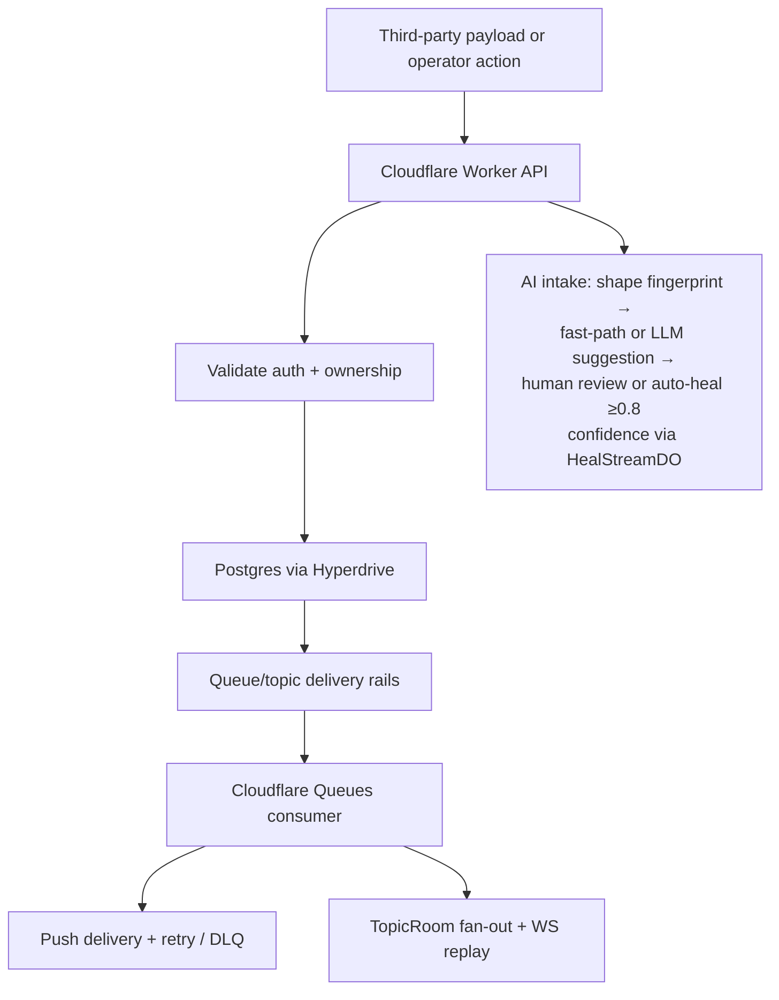

# IngestLens

**AI-assisted integration observability for payload intake, mapping, delivery, and replay-aware debugging.**

Built solo by [Ozby](https://github.com/ozby) as a portfolio of integration primitives: deterministic intake validation, AI-assisted mapping repair, delivery rails, replay, and measurement harnesses for delivery correctness.

## Why this repo is worth reviewing

- **Adaptive intake repair** — detects payload drift, proposes mapping fixes with AI, validates them deterministically, and routes low-confidence cases to human review.
- **Delivery primitives with proof** — models queues, topic fan-out, push retries/DLQ, and replay-aware operator workflows.
- **Measurement over hand-waving** — ships a consistency lab that compares delivery paths for correctness, latency, and operational cost.

## Quick start

```bash
pnpm install
pnpm dev
```

`pnpm install` runs `postinstall`, which delegates to the shared
`setup:agent` script (`bun ./scripts/run-webpresso-cli.ts agent setup --yes
--overwrite`). The wrapper resolves the installed unified CLI entrypoint
directly, so this repo does not depend on whichever package currently owns the
ambient `webpresso` bin in `node_modules/.bin`.

Secrets and database connections are managed via `with-secrets` (Doppler + Neon providers). No `.env` files.

## Repo map

- `apps/workers` — Cloudflare Worker API, intake pipeline, auth, delivery, replay
- `apps/client` — React SPA for queues, topics, metrics, and intake review flows
- `apps/lab` — consistency lab UI and workloads for delivery-path comparison
- `packages/*` — shared types, UI, logging, test helpers, lab core
- `infra` — Pulumi-managed Cloudflare infrastructure
- `docs` — architecture, guarantees, ADRs, vision, and project records

## Showcase entrypoints

- **Architecture overview:** [`docs/system-architecture.md`](docs/system-architecture.md)
- **AI intake + mapping flow:** [`docs/architecture.md`](docs/architecture.md)
- **Delivery semantics:** [`docs/delivery-guarantees.md`](docs/delivery-guarantees.md)
- **Scale and tradeoffs:** [`docs/scale-considerations.md`](docs/scale-considerations.md)
- **Vision + project records:** [`docs/research/product/VISION.md`](docs/research/product/VISION.md), [`docs/project/README.md`](docs/project/README.md)

## Engineering proof points

- **Deterministic safety over AI vibes** — model output is contract-checked, confidence-gated, and reviewable before promotion.
- **Failure-path honesty** — delivery guarantees, retries, DLQ behavior, and replay semantics are documented as first-class product constraints.
- **Evidence-backed systems thinking** — the consistency lab compares delivery paths on correctness, latency, and operational cost.

## Architecture at a glance



<details>
<summary>Contributor workflows</summary>

## Verification and demo flows

### E2E

```bash
pnpm e2e --suite foundation
pnpm e2e --suite full
```

Suites: `foundation`, `auth`, `messaging`, `hardening`, `intake`, `demo`, `client`, `branding`, `full`.

### Verify

```bash
pnpm check
pnpm test
pnpm build
pnpm docs:check
pnpm blueprints:check
```

### Local GitHub Actions testing

```bash
pnpm act:list
pnpm act:ci
pnpm act:e2e
pnpm act:cleanup
```

### Deploy

```bash
bun ./infra/src/deploy/deploy.ts dev
bun ./infra/src/deploy/deploy.ts prd
```

</details>

## Docs

- [System architecture](docs/system-architecture.md)
- [Architecture](docs/architecture.md)
- [Delivery guarantees](docs/delivery-guarantees.md)
- [Scale considerations](docs/scale-considerations.md)
- [ADR index](docs/adrs/README.md)
- [Blueprints](blueprints/README.md)
- [Project records](docs/project/README.md)
