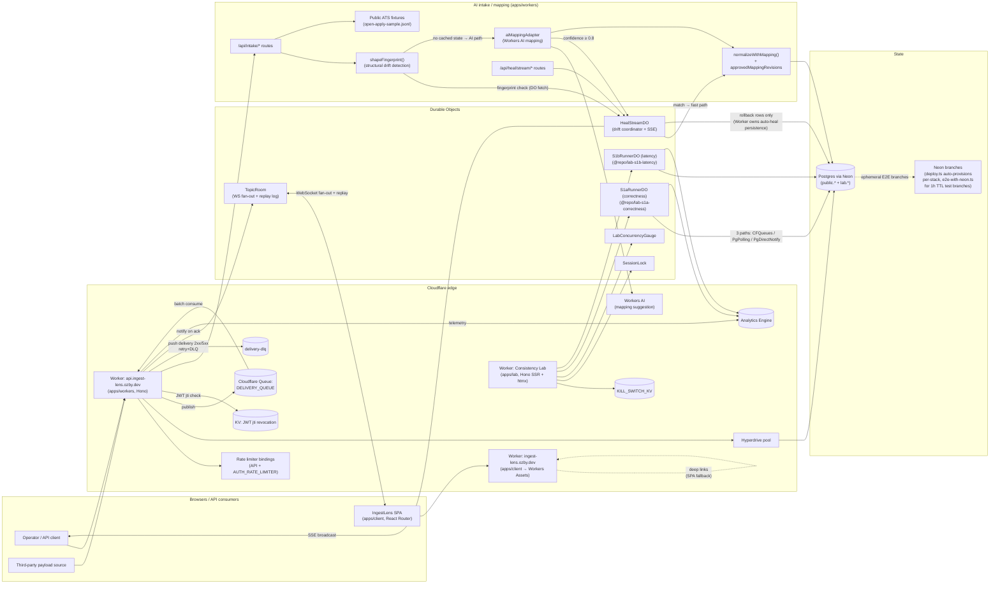

# System Architecture

End-to-end view of IngestLens: edge entrypoints, Worker apps, durable
state, AI mapping path, and Consistency Lab. Treat this as the canonical
mermaid chart for the repo. Component-level invariants and code paths
live in [`architecture.md`](./architecture.md).

## Top-level diagram

## Layer notes

- **Edge SPA worker** (`apps/client`): Workers Assets host with SPA
  fallback for deep links. No server-side rendering.
- **API worker** (`apps/workers`): Hono on Cloudflare Workers. Owns
  auth, queue/topic CRUD, push delivery consumer, AI intake routes,
  WebSocket upgrade for `TopicRoom` DOs.
- **Lab worker** (`apps/lab`): Hono SSR + htmx; isolated kill switch,
  cost ceiling, and SessionLock-gated runners. Never shares state with
  the API worker beyond the `lab.*` schema.
- **Durable Objects**: `TopicRoom` is the production fan-out + reconnect
  replay primitive; `HealStreamDO` (one per `sourceSystem:contractId:contractVersion`)
  serializes concurrent heal decisions via the CF input gate, owns the live
  in-memory fingerprint cache and SSE stream, and writes rollback revision rows;
  the Worker owns Postgres persistence for auto-heal (inserts
  `approvedMappingRevisions` + `intakeAttempts`) and publish completion;
  `SessionLock`, `LabConcurrencyGauge`, and the two scenario runner DOs
  (`S1aRunnerDO` from `@repo/lab-s1a-correctness`, `S1bRunnerDO` from
  `@repo/lab-s1b-latency`) are lab-internal.
- **Postgres**: single Neon project. Production tables live in
  `public.*`; lab tables strictly under `lab.*` (CI-enforced).
  Per-stack Neon branches are auto-provisioned by `deploy.ts` before
  `pulumi up` (for non-`prd` stacks). E2E branches are created with 1h TTL
  by `apps/e2e/scripts/e2e-with-neon.ts` and auto-deleted on test completion.
  The shared `packages/neon` implements `@webpresso/db-branching`'s
  `BranchProvider` interface for create/delete flows. Hyperdrive is the
  runtime pool for Workers; Neon is the managed Postgres origin and
  branching substrate. Core queue/topic relationships are enforced with
  foreign keys and cascades so deletes do not rely on application-side cleanup,
  and `ownerId` is FK-backed to `users.id` for the main multi-tenant tables.
- **AI intake path**: only AI call site is mapping repair suggestion.
  Shared attempt/mapping conversion helpers live in
  `apps/workers/src/intake/services/records.ts`.
  `shapeFingerprint()` detects structural drift. The fast-path check queries
  `HealStreamDO` in-memory state (not Postgres); on match the LLM is skipped
  and the record is normalized without creating a new intake attempt row.
  On mismatch the LLM generates mapping suggestions; at ≥ 0.8 confidence
  `HealStreamDO.tryHeal()` serializes the auto-heal reservation, the Worker
  persists `approvedMappingRevisions` + `intakeAttempts` in a transaction,
  then commits the heal to the DO. The `analyzing` SSE event uses a
  hardcoded placeholder confidence; the real LLM confidence is available
  in the Worker after `suggestMappings()` returns. Every step after mapping
  approval — schema validation, normalization, publish — is deterministic code.
- **Workers test substrate**: `@webpresso/agent-workers-test` is the
  upstream for `BaseWorkerEnv`, `createMockExecutionContext`, and
  `createMockHyperdrive`. `packages/test-utils` only re-exports
  `deepFreeze` for cross-package use.

## Cross-cutting concerns

| Concern          | Where it lives                                                                                                                                                  |
| ---------------- | --------------------------------------------------------------------------------------------------------------------------------------------------------------- |
| Auth             | `apps/workers/src/middleware/auth.ts` + eventually consistent KV `KV` (API Worker jti revocation, h-001); lab uses separate `KILL_SWITCH_KV` for runtime gating |
| Rate limiting    | API + `AUTH_RATE_LIMITER` bindings (per-PoP token bucket, ADR 0004)                                                                                             |
| Telemetry        | Analytics Engine — `analytics-engine-telemetry` blueprint                                                                                                       |
| Replay           | `TopicRoom` DO + Postgres `messages.seq` (`message-replay-cursor`)                                                                                              |
| Bundle budgets   | `pnpm client:bundle:check` (`client-route-code-splitting`)                                                                                                      |
| Mutation testing | Stryker per-package + CI gate (`stryker-mutation-guardrails`)                                                                                                   |
| Doppler secrets  | `bun ./scripts/with-doppler.ts` wrapper (no `.env`)                                                                                                             |

## Related

- [Architecture (component detail)](./architecture.md)
- [Delivery guarantees](./delivery-guarantees.md)
- [Scale considerations](./scale-considerations.md)
- [ADR index](./adrs/README.md)
- [Project records](./project/README.md)
